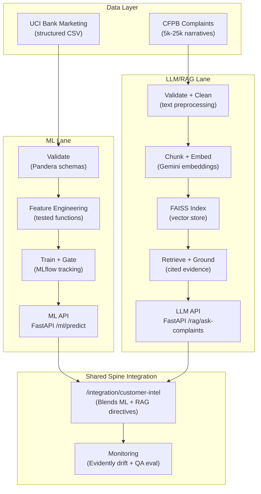

# Meridian Customer Intelligence Platform 🚀

A production-grade customer outreach and complaint intelligence system combining classical Machine Learning (structured campaign prediction) and LLM/RAG (grounded CFPB narratives) behind a single production spine.

## 🏗️ Architecture System Flow



---

## ⚡ Quick Start

### 1. Prerequisites
- Python 3.10+
- A Google Gemini API Key (stored in `.env`)

### 2. Installation
Clone the repository and install in editable mode:
```bash
# Create virtual environment
python -m venv .venv
.venv\Scripts\activate

# Install package
pip install -e .
```

### 3. Setup Configuration
Copy environment variables template and configure your Gemini API Key:
```bash
cp .env.example .env
```
Inside `.env`:
```env
GEMINI_API_KEY=YOUR_GEMINI_API_KEY_HERE
MLFLOW_TRACKING_URI=http://localhost:5000
EMBEDDING_MODEL_NAME=models/text-embedding-004
GEMINI_MODEL_NAME=gemini-1.5-flash
```

---

## 🛠️ Running the Pipelines

The project runs completely through reproducible CLI pipeline scripts:

### 1. Execute ML pipeline
Downloads data, validates schemas, engineers features, trains XGBoost, logs to MLflow, and gates model promotion:
```bash
python pipelines/run_ml_pipeline.py
```
*(Use `--sample` flag for quick CI/CD dry runs)*

### 2. Execute RAG pipeline
Downloads complaints, embeds text using Gemini embedding model in batches, and builds local FAISS vector store:
```bash
python pipelines/run_rag_pipeline.py
```

### 3. Execute Monitoring & Drift pipeline
Simulates synthetic data shift in demographics and economic indicators, executes data drift tests via Evidently AI, evaluates 10 test QA cases, and generates a gorgeous unified HTML dashboard:
```bash
python pipelines/run_monitoring.py
```
Outputs report to `monitoring/reports/monitoring_report.html`.

---

## 🚀 Serving the APIs

Start the unified FastAPI server:
```bash
uvicorn app.main:app --host 0.0.0.0 --port 8000 --reload
```

Interactive swagger docs are auto-generated at: http://localhost:8000/docs

### Endpoint Smoke Tests

#### 1. Liveness & Readiness Diagnostics
```bash
curl http://localhost:8000/health
```

#### 2. ML Campaign Conversion Prediction
```bash
curl -X POST http://localhost:8000/ml/predict \
  -H "Content-Type: application/json" \
  -d '{
    "age": 35,
    "job": "management",
    "marital": "married",
    "education": "university.degree",
    "default": "no",
    "housing": "yes",
    "loan": "no",
    "contact": "cellular",
    "month": "may",
    "day_of_week": "mon",
    "campaign": 2,
    "pdays": 999,
    "previous": 0,
    "poutcome": "nonexistent",
    "emp.var.rate": -1.8,
    "cons.price.idx": 92.893,
    "cons.conf.idx": -46.2,
    "euribor3m": 1.299,
    "nr.employed": 5099.1
  }'
```

#### 3. High-Volume Batch Scoring
```bash
curl -X POST http://localhost:8000/ml/batch-score \
  -H "Content-Type: application/json" \
  -d '[
    {
      "age": 35,
      "job": "management",
      "marital": "married",
      "education": "university.degree",
      "default": "no",
      "housing": "yes",
      "loan": "no",
      "contact": "cellular",
      "month": "may",
      "day_of_week": "mon",
      "campaign": 2,
      "pdays": 999,
      "previous": 0,
      "poutcome": "nonexistent",
      "emp.var.rate": -1.8,
      "cons.price.idx": 92.893,
      "cons.conf.idx": -46.2,
      "euribor3m": 1.299,
      "nr.employed": 5099.1
    }
  ]'
```

#### 4. RAG Grounded Complaints Q&A (with Metadata Filtering)
```bash
curl -X POST http://localhost:8000/rag/ask-complaints \
  -H "Content-Type: application/json" \
  -d '{
    "question": "What issues are clients reporting about credit card billing?",
    "product": "Credit card or prepaid card",
    "k": 3,
    "threshold": 0.3
  }'
```

#### 5. Integrated customer-intel Endpoint (with RAG Filtering)
```bash
curl -X POST http://localhost:8000/integration/customer-intel \
  -H "Content-Type: application/json" \
  -d '{
    "customer": {
      "age": 35,
      "job": "management",
      "marital": "married",
      "education": "university.degree",
      "default": "no",
      "housing": "yes",
      "loan": "no",
      "contact": "cellular",
      "month": "may",
      "day_of_week": "mon",
      "campaign": 2,
      "pdays": 999,
      "previous": 0,
      "poutcome": "nonexistent",
      "emp.var.rate": -1.8,
      "cons.price.idx": 92.893,
      "cons.conf.idx": -46.2,
      "euribor3m": 1.299,
      "nr.employed": 5099.1
    },
    "complaints_question": "Are there issues with checking account overdraft fees?",
    "product": "Checking or savings account"
  }'
```

#### 6. Observability Metrics
```bash
curl http://localhost:8000/metrics
```

---

## 🔒 Hardened Production-Grade Enhancements

The platform has been hardened with the following enterprise-grade engineering specs:
1. **Relative Promotion Gates**: 
   - **ML Pipeline**: An automated safety gate promotes new XGBoost models only if PR-AUC improves by $\ge 3$ percentage points, F1 drops by $\le 2$ percentage points, and inference latency stays $< 50\text{ms}$.
   - **RAG Pipeline**: Promotes a new FAISS vector index only if retrieval hit-rate and groundedness accuracy improve against a fixed golden evaluation suite.
2. **Hybrid Semantic & Metadata Search**: Support for filtering CFPB narratives on `product`, `company`, `date`, and `issue` via Python-based hybrid filtering on the top-100 FAISS recall pool.
3. **In-Memory Observability**: Thread-safe middleware tracks endpoint latency and prediction distribution metrics, exposed via a Prometheus-compatible `/metrics` endpoint.
4. **Secret Hygiene**: Zero hardcoded API keys. Strictly verified environment configuration.

---

## 🐋 Docker Compose Setup

Run the full local production-like stack, including the API server and MLflow tracking dashboard:
```bash
docker compose up --build
```
MLflow dashboard: http://localhost:5000

---

## ☁️ Azure Container Apps Deployment

1. Build & push image to Azure Container Registry (ACR):
```bash
az acr build --registry <acr_name> --image customer-intel-platform:latest .
```

2. Deploy Container App with scale-to-zero configuration to keep it free tier:
```bash
az containerapp create \
  --name customer-intel-api \
  --resource-group <rg_name> \
  --environment <env_name> \
  --image <acr_name>.azurecr.io/customer-intel-platform:latest \
  --target-port 8000 \
  --ingress external \
  --min-replicas 0 \
  --max-replicas 1 \
  --env-vars GEMINI_API_KEY=YOUR_GEMINI_API_KEY_HERE
```

---

## 🧪 Testing

Run linting and test coverage locally:
```bash
# Run tests
pytest tests/ -v
```

