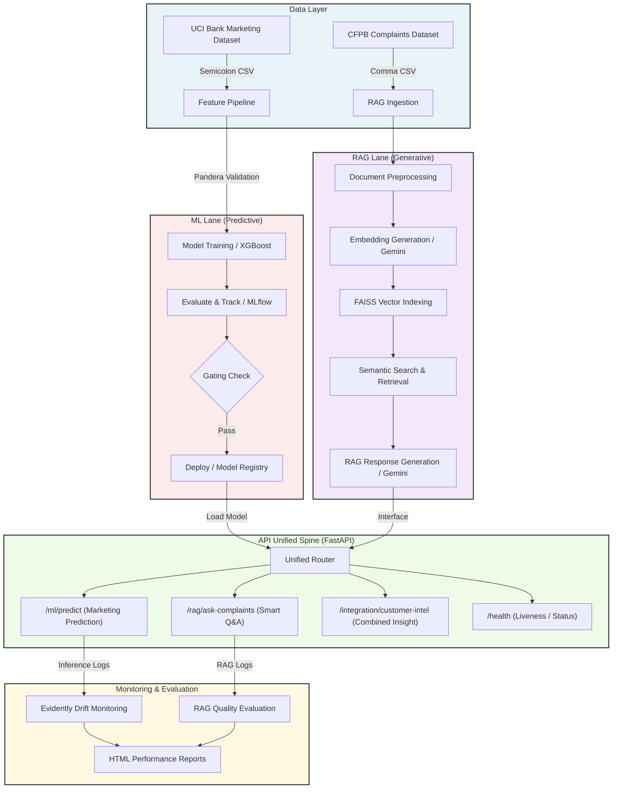

# Meridian Customer Intelligence Platform Architecture

The **Meridian Customer Intelligence Platform** is an enterprise-grade, end-to-end machine learning and Generative AI system designed to analyze customer behavior, predict marketing conversion, and intelligently retrieve and respond to customer complaints. The platform integrates a predictive ML pipeline with a modern Retrieval-Augmented Generation (RAG) lane, all served via a unified FastAPI application and monitored for data drift and service quality.

## System Architecture Diagram

Below is the conceptual architecture showing how data flows from ingestion through preprocessing, model inference, retrieval, and unified delivery, wrapped with continuous evaluation.



---

## Component Descriptions

### 1. Data Layer
* **UCI Bank Marketing**: Consists of customer demographics, contact history, and macroeconomic variables. Used to train the XGBoost classifier predicting whether a customer will subscribe to a term deposit.
* **CFPB Complaints**: Contains raw customer narratives, product types, and company responses. Used as the knowledge base for semantic search and generative query resolution.

### 2. ML Lane (Predictive Engine)
* **Validation**: Input data is strictly validated using `Pandera` schemas to ensure data quality and schema compliance.
* **Model Pipeline**: Feature engineering, preprocessing, and training are orchestrated using an `XGBoost` classifier.
* **Tracking & Gating**: Training experiments and model parameters are tracked in `MLflow`. A gating script compares the candidate model's performance (ROC-AUC) against historical baselines before marking it as "production-ready".

### 3. RAG Lane (Generative Engine)
* **Ingestion & Embedding**: Customer complaint narratives are chunked and embedded using the Google Gemini API (`text-embedding-004`).
* **Vector Store**: A lightweight `FAISS` index is constructed from the embeddings to perform fast, highly scalable similarity search.
* **Retrieval & Generation**: When a user queries `/rag/ask-complaints`, the system retrieves the most relevant past complaints and passes them as context to Gemini (`gemini-1.5-flash`) to generate a professional, context-aware summary or resolution recommendation.

### 4. API Spine (FastAPI Service)
A central, unified FastAPI server exposes four key operational endpoints:
* `/health`: System and dependency status checking.
* `/ml/predict`: Runs real-time inference on customer profiles to predict term-deposit subscription.
* `/rag/ask-complaints`: Interfaces with the RAG pipeline to answer customer/agent questions about complaint patterns.
* `/integration/customer-intel`: Merges ML predictions and RAG-retrieved historical complaints for a comprehensive customer profile view.

### 5. Monitoring & Drift
* **ML Drift**: Using `Evidently`, incoming real-time feature distributions are compared to reference training distributions to detect feature and target drift.
* **RAG Evaluation**: Assesses retrieval precision and response coherence to prevent hallucinations.
* **Reports**: Periodic HTML reporting dashboards are generated automatically under `monitoring/reports/`.

---

## Tech Stack

| Technology | Purpose | Version / Notes |
|---|---|---|
| **Python** | Primary Programming Language | `3.10+` |
| **FastAPI** | High-performance API Unified Spine | `^0.110.0` |
| **XGBoost** | Gradient-boosted decision trees for ML classifier | `^2.0.0` |
| **scikit-learn** | Machine learning preprocessing and evaluation utilities | `^1.4.0` |
| **MLflow** | Experiment tracking and model registry | `^2.11.0` |
| **Google Gemini API** | Embeddings (`text-embedding-004`) and GenAI generation (`gemini-1.5-flash`) | `google-generativeai` |
| **FAISS** | Fast Vector database/indexing library | `faiss-cpu ^1.8.0` |
| **Evidently** | Data drift monitoring and visual report generation | `^0.4.15` |
| **Pandera** | Robust data validation schemas | `^0.18.0` |
| **Docker & Compose** | Containerized packaging & local multi-service orchestration | |
| **GitHub Actions** | Automated CI/CD pipeline | |

---

## Directory Structure

```text
customer-intelligence-platform/
├── .env.example
├── .gitignore
├── Dockerfile
├── docker-compose.yml
├── Makefile
├── pyproject.toml
├── README.md
├── app/
│   ├── __init__.py
│   ├── main.py
│   ├── config.py
│   ├── routers/
│   │   ├── __init__.py
│   │   ├── ml.py
│   │   ├── rag.py
│   │   └── integration.py
│   └── utils/
│       ├── __init__.py
│       └── gemini_client.py
├── src/
│   ├── __init__.py
│   ├── ml/
│   │   ├── __init__.py
│   │   ├── train.py
│   │   ├── predict.py
│   │   └── schemas.py
│   ├── rag/
│   │   ├── __init__.py
│   │   ├── ingest.py
│   │   ├── retrieve.py
│   │   └── vector_store.py
│   └── monitoring/
│       ├── __init__.py
│       └── report.py
├── pipelines/
│   ├── __init__.py
│   ├── train_pipeline.py
│   └── evaluate_pipeline.py
├── data/
│   ├── raw/
│   ├── processed/
│   └── sample/
│       ├── bank-additional-full-sample.csv
│       └── cfpb_complaints_sample.csv
├── monitoring/
│   └── reports/
└── tests/
    ├── __init__.py
    ├── test_api.py
    ├── test_ml.py
    └── test_rag.py
```

---

## Deployment Configuration

* **Local Orchestration**: Run `docker-compose up --build` to launch the unified FastAPI application alongside a local MLflow tracking server.
* **Production Stretch Goal**: Deploy the Docker containerized API to **Azure Container Apps (ACA)** with automatic scaling, and point to a hosted MLflow registry and cloud database.
